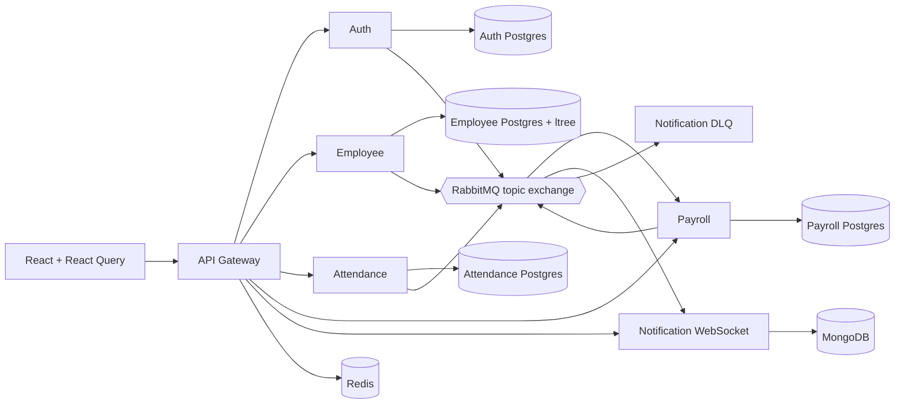

# Atlas EMS

Atlas EMS is a production-oriented Employee Management System built as a TypeScript microservices monorepo. It deliberately favors explicit ownership, durable asynchronous workflows, and observable failure modes over a convenient but tightly coupled CRUD application.

## Architecture first

### Service boundaries

| Service | Owns | Synchronous responsibility | Asynchronous responsibility |
| --- | --- | --- | --- |
| Auth | identities, roles, refresh-token families | login, refresh rotation, JWT verification metadata | emits identity lifecycle audit events |
| Employee | employee profiles and reporting hierarchy | profile CRUD, `ltree` org-chart queries | emits employee/manager change events |
| Attendance | clock sessions, leave requests, approval history | clock in/out and leave state-machine transitions | emits attendance and leave domain events |
| Payroll | compensation, pay runs, payslips, leave-balance projection | idempotent pay-run initiation and payslip retrieval | consumes leave/attendance events; emits pay-run and payslip events |
| Notification | delivery attempts, notification audit logs | WebSocket presence and delivery status lookup | consumes domain events; email/WebSocket delivery with retry and DLQ |
| Gateway | route policy only, never domain data | auth verification, trace propagation, Redis rate limiting, routing | none |

The gateway is intentionally thin. It verifies access tokens but does not become a shared business-data service. Each downstream service remains responsible for authorization against its own resources.

### Event contract

Every broker message uses this envelope. `eventId` is immutable and is the consumer idempotency key; `traceId` connects logs across service boundaries. Producers write the payload to their local transactional outbox in the same transaction as the business mutation, then publish with RabbitMQ publisher confirms.

```ts
type DomainEvent<TType extends string, TData> = {
  eventId: string;                 // UUID
  type: TType;                     // e.g. leave.approved.v1
  version: 1;
  occurredAt: string;              // ISO-8601 UTC
  producer: string;
  aggregate: { type: string; id: string };
  traceId: string;
  causationId?: string;
  data: TData;
};
```

| Routing key | Producer | Required payload | Consumers |
| --- | --- | --- | --- |
| `employee.created.v1` | Employee | `employeeId`, `managerId?`, `path`, `department`, `email` | Payroll, Notification |
| `employee.manager-changed.v1` | Employee | `employeeId`, `previousManagerId?`, `managerId?`, `path` | Attendance, Notification |
| `attendance.clocked-in.v1` | Attendance | `attendanceId`, `employeeId`, `at` | Payroll |
| `attendance.clocked-out.v1` | Attendance | `attendanceId`, `employeeId`, `clockInAt`, `clockOutAt`, `workedMinutes` | Payroll |
| `leave.requested.v1` | Attendance | `leaveRequestId`, `employeeId`, `leaveType`, `startsOn`, `endsOn`, `days`, `state` | Notification |
| `leave.transitioned.v1` | Attendance | `leaveRequestId`, `employeeId`, `from`, `to`, `actorId`, `reason?` | Notification, Payroll |
| `leave.approved.v1` | Attendance | `leaveRequestId`, `employeeId`, `leaveType`, `startsOn`, `endsOn`, `days`, `approvedBy` | Payroll, Notification |
| `leave.rejected.v1` | Attendance | `leaveRequestId`, `employeeId`, `reason`, `rejectedBy` | Notification |
| `payroll.run.requested.v1` | Payroll | `payRunId`, `employeeId`, `periodStart`, `periodEnd`, `idempotencyKey` | Payroll worker |
| `payroll.run.processed.v1` | Payroll | `payRunId`, `employeeId`, `grossCents`, `deductionsCents`, `netCents`, `status` | Notification |
| `payslip.generated.v1` | Payroll | `payslipId`, `payRunId`, `employeeId`, `storageKey` | Notification |
| `notification.delivered.v1` | Notification | `notificationId`, `sourceEventId`, `channel`, `recipientId` | audit/analytics |
| `notification.failed.v1` | Notification | `notificationId`, `sourceEventId`, `channel`, `attempt`, `errorCode` | audit/operations |

An incompatible payload change gets a new routing-key version, for example `leave.approved.v2`; consumers can migrate independently.

### Data ownership

| Service | Store | Key tables / collections | Design note |
| --- | --- | --- | --- |
| Auth | PostgreSQL + Redis | `users`, `refresh_token_families`, `refresh_tokens`, `outbox`, `inbox` | refresh tokens are hashed and rotated; Redis is used for short-lived revocation/rate-limit state |
| Employee | PostgreSQL with `ltree` | `employees`, `outbox`, `inbox` | `path ltree` plus GiST index supports descendant org queries without recursive CTEs |
| Attendance | PostgreSQL | `attendance_records`, `leave_requests`, `leave_transitions`, `outbox`, `inbox` | transition history is append-only and validates the workflow state machine |
| Payroll | PostgreSQL | `compensation`, `pay_runs`, `payslips`, `leave_balance_projection`, `idempotency_records`, `outbox`, `inbox` | unique period/employee and inbox rows make pay processing idempotent |
| Notification | MongoDB | `notificationDeliveries`, `consumerEvents` | flexible audit/delivery payloads and high-write log retention fit document storage |
| Gateway | Redis | rate-limit windows, optional token deny-list cache | no domain database |

Services never directly query another service's database. Foreign identities are UUID references and read models are rebuilt from events where cross-service data is needed.

### System view



### Leave-to-payroll flow

```mermaid
sequenceDiagram
  participant M as Manager / HR
  participant A as Attendance
  participant B as RabbitMQ
  participant P as Payroll
  participant N as Notification
  M->>A: transition leave request
  A->>A: validate state + write transition/outbox atomically
  A-->>M: 200 with state and projectionStatus=pending
  A->>B: leave.approved.v1 (publisher confirm)
  B->>P: durable payroll queue
  P->>P: insert inbox(eventId); update leave_balance_projection
  B->>N: durable notification queue
  N->>N: mocked email + WebSocket push
  P-->>M: frontend refetch shows projectionStatus=synchronized
```

## Key engineering decisions

- **RabbitMQ rather than Kafka:** RabbitMQ is lighter for a portfolio environment and has first-class topic routing, ack/retry, TTL, and dead-letter queues. The outbox/inbox pattern retains the important at-least-once delivery and idempotent consumer discussion that would also apply to Kafka.
- **Transactional outbox + inbox:** an HTTP transaction commits business data and an outbox row together. A publisher only marks an outbox row sent after broker confirmation. Consumers insert `event_id` into an inbox using a unique key before applying side effects, making redelivery harmless.
- **Eventual consistency is visible:** Attendance returns `payrollProjection: { status: "pending" }` after an approval. The UI polls the Payroll projection endpoint and labels it synchronized only after Payroll consumes the event. It does not claim a distributed transaction exists.
- **Idempotent money writes:** `Idempotency-Key` is required for pay-run initiation. The key, request hash, and serialized response are persisted; a `(employee_id, period_start, period_end)` unique constraint prevents a duplicate payment even with a different key or worker retry.
- **Circuit breaker:** Attendance's employee-directory lookup is wrapped in `opossum` with a cached fallback. An Employee outage prevents new validation-dependent writes but never corrupts existing workflow data or brings down other services.
- **Tracing and observability:** gateway and services propagate `x-trace-id`/`traceparent`; JSON Pino logs include the trace ID. Every service exposes `/health/live`, `/health/ready`, and Prometheus text at `/metrics`.
- **Graceful notification failure:** notifications are independent consumers. A Notification outage leaves core API writes committed and messages durable. Failed delivery retries use a TTL retry queue and ultimately land in `notification.dlq` for inspection/replay.

## Repository layout

```text
apps/web/                 React, TypeScript, Tailwind, React Query
packages/contracts/       Versioned events and API types
packages/platform/        Nest cross-cutting infrastructure
services/auth/            Token issuance, refresh rotation, RBAC
services/employee/        Profiles and ltree org hierarchy
services/attendance/      Clocking and leave state machine
services/payroll/         Idempotent payroll and PDF payslips
services/notification/    Async delivery, WebSocket, DLQ
services/gateway/         Routing, auth, rate limiting, trace IDs
infra/postgres/           Multi-database bootstrap
k8s/                      Deployment, Service, ConfigMap, HPA templates
tests/integration/        Docker Compose event-flow test
load/                     k6 gateway health/load scenario
```

## Local development

Prerequisites: Node 22+ and Docker Compose. This workspace was created on Windows, so commands use `npm.cmd`.

```powershell
npm.cmd install
npm.cmd run build
docker compose up --build
```

The dashboard is available at `http://localhost:5173`; the gateway is at `http://localhost:3000`. Local development credentials are seeded by the Auth Service: `admin@atlas.local` / `ChangeMe123!`.

## Verification

```powershell
npm.cmd test
npm.cmd run test:integration
npm.cmd run test:load
```

`test:integration` starts the Compose environment, approves a leave request, then asserts that Payroll's projection and Notification's delivery log observe the same event ID. `test:load` runs `load/gateway-health.js` against `/health/live`.

### Load result

The load script is included but could not be executed in this workspace because Docker/Compose and k6 are not installed. Run `npm.cmd run test:load` against a running Compose stack to record the machine-specific requests/sec and p95 latency; the script enforces a p95 target below 250 ms and a failure rate below 1%. Results are intentionally not fabricated.

## Deployment

`k8s/` contains per-service Deployments, Services, ConfigMaps, Secrets templates, probes, resource requests/limits, and an HPA example. Production deployment should replace the Compose credentials with a secret manager, use managed PostgreSQL/MongoDB/Redis/RabbitMQ, and run the outbox publisher as a separate worker deployment where throughput warrants it.
